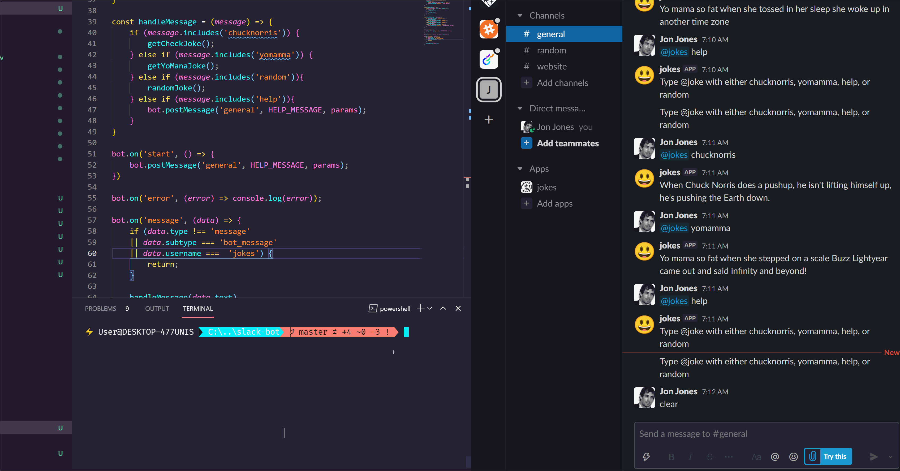

# Slackbot - By Jon D Jones 💥

This project makes uses of:

- [slack-bot-api](https://github.com/mishk0/slack-bot-api)

## 👾 How To Use ☄️

- Create a slackapp (legacy)
- Generate a user token
- Add the token to the app
- Run the script with `npm run start`

## 👻 How To Install 👺

Run:

`npm run i`